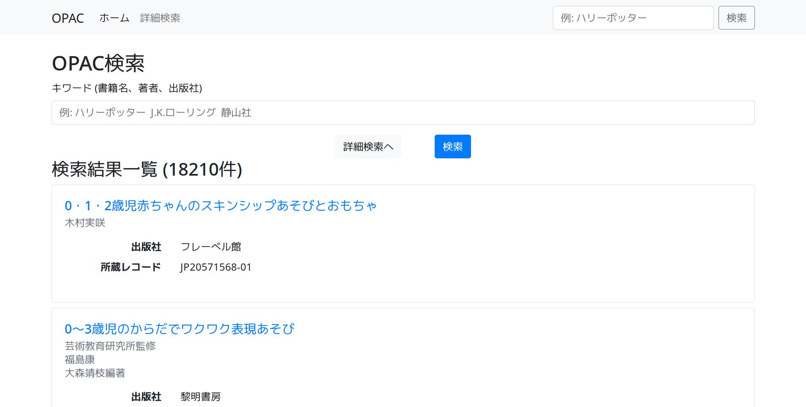
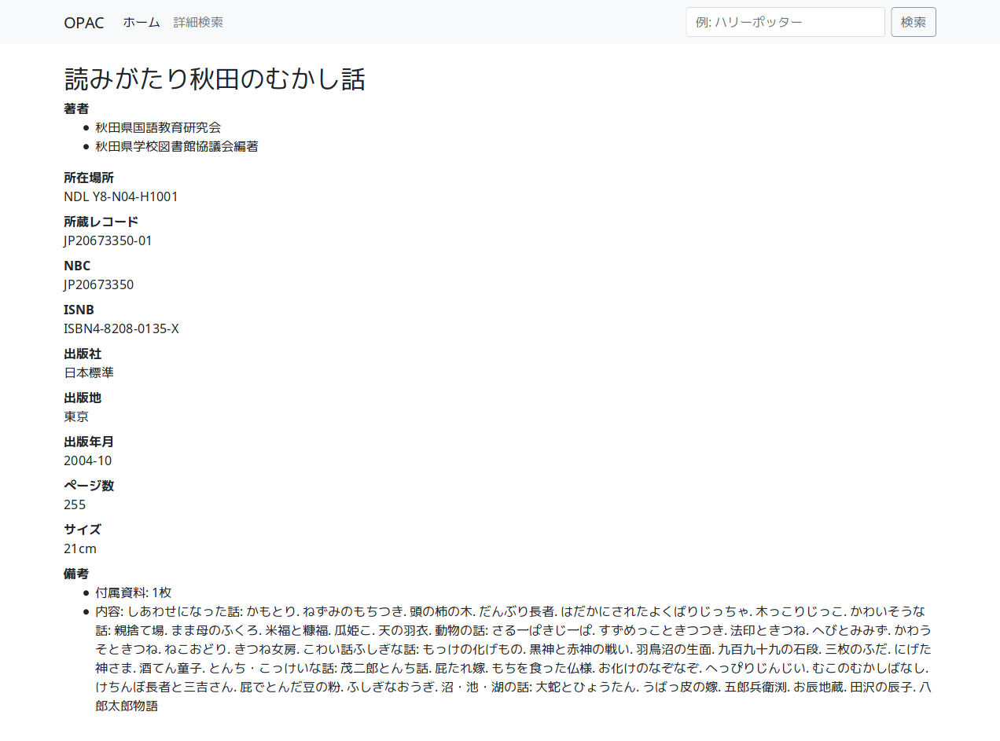

# opac

## Generating the data

```
ruby create_databaes.rb
```

## Sanity checking of the data

```
sqlite> select count(*) from books;
18210
sqlite> select count(*) from books where isbn is null;
5080
sqlite> select count(*) from books where title like '%図書館%';
11
sqlite> select count(*) from books join book_authors on books.id = book_authors.book_id join authors on book_authors.author_id = authors.id where authors.full_name like '%図書館%';
8
sqlite> select count(*) from books join book_authors on books.id = book_authors.book_id join authors on book_authors.author_id = authors.id where authors.full_name like '%図書館%' and title like '%図書館%';
1
```

## Running the app

The app can be run as a regular Sinatra application with

```
ruby opac.rb
```

It can also be executed as a CGI application by using `cgi-bin/app.rb`
as an entry point.

## Screenshots

### Index page



### Simple search


### Advanced search


### Book details


